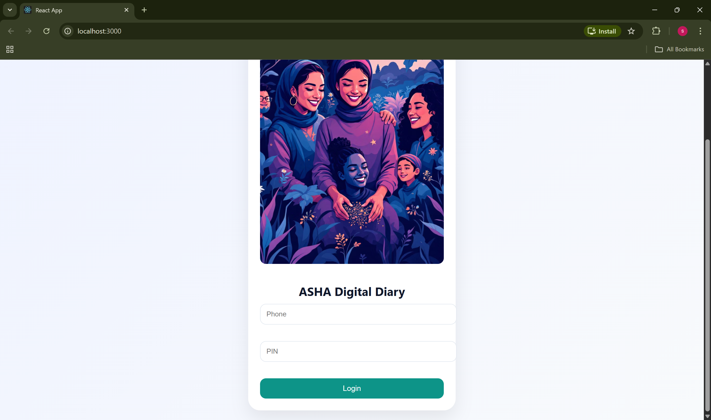
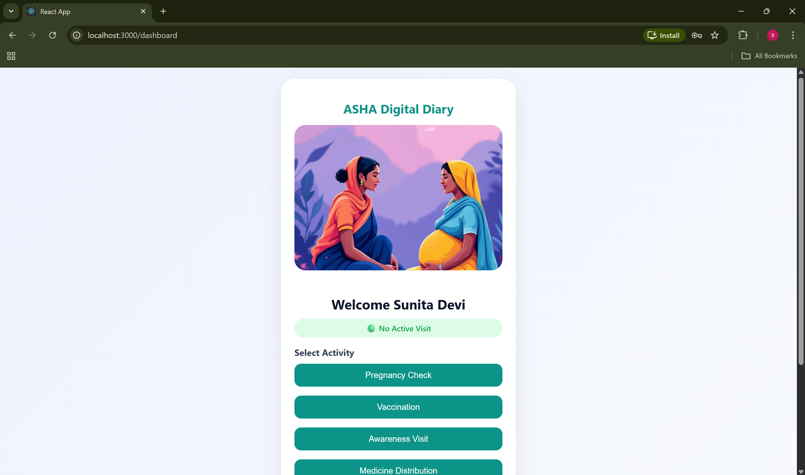

# 🩺 ASHA Digital Diary & Workload Tracker

A full-stack web application designed to digitize ASHA workers’ field visits, track GPS-based activities, calculate travel distance, and ensure transparent incentive distribution.

---

## 🚀 Problem Statement

ASHA workers are the backbone of rural healthcare in India.  
However, they face:

- Manual documentation
- Travel verification issues
- Time-consuming reporting
- Under-compensated work due to lack of proof

This platform solves these problems using technology.

---

## 💡 Solution

ASHA Digital Diary provides:

- 📍 GPS-based visit tracking
- ⏱ Real-time visit timer
- 🧮 Automatic duration & distance calculation
- 💰 Transparent incentive computation
- 📊 Daily performance reports
- 🟢 Active Visit indicator
- 📌 Activity-based categorization

---

## 🛠 Tech Stack

### Frontend
- React.js
- CSS (Mobile-first design)
- React Router

### Backend
- Node.js
- Express.js
- MongoDB
- Mongoose

### Google Technology Used
- Google Maps Platform (for GPS tracking & distance validation)
- Future scalability planned via Google Cloud Platform

---

## 📊 Key Features

- ASHA Registration & Login
- Start/End Visit System
- Haversine Distance Calculation
- Live Running Timer
- Activity Selection
- Incentive Engine
- Daily Report Dashboard

---

## 📸 Application Screenshots

### 🔐 Login Page

### 🏠 Dashboard

### 🔴 Active Visit with Live Timer

### 📊 Code

## 🏗 System Architecture

(User Interface) → React Frontend  
→ Node.js API  
→ MongoDB Database  
→ Google Maps API Integration  

---

## 🌍 Future Enhancements

- Supervisor Dashboard
- Weekly/Monthly Reports
- Firebase Authentication
- Google Cloud Deployment
- AI-based Workload Prediction

---

## 🎯 Hackathon Participation

Built as part of HackO’Clock 2.0 (GDG IILM University).

---

## 👨‍💻 Author

**Sarthak Tyagi**  
B.Tech CSE | Full Stack Developer | AI Enthusiast